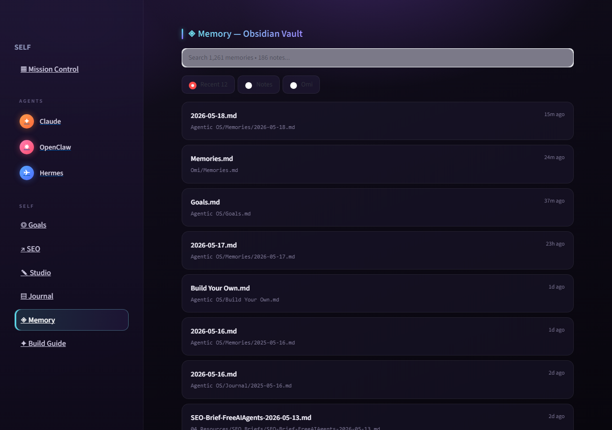
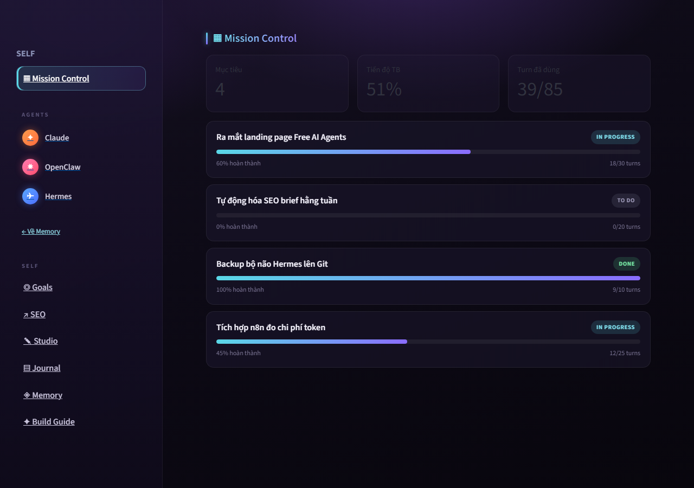
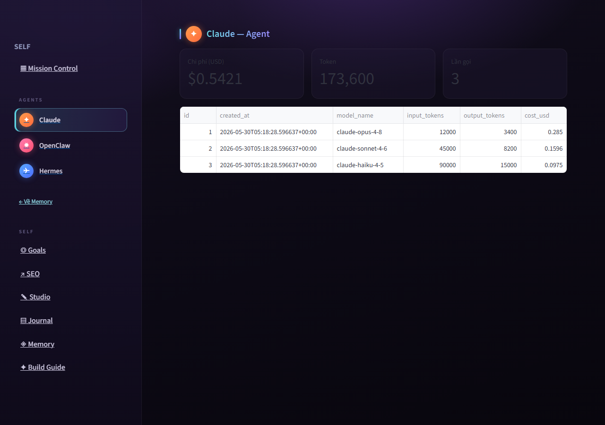
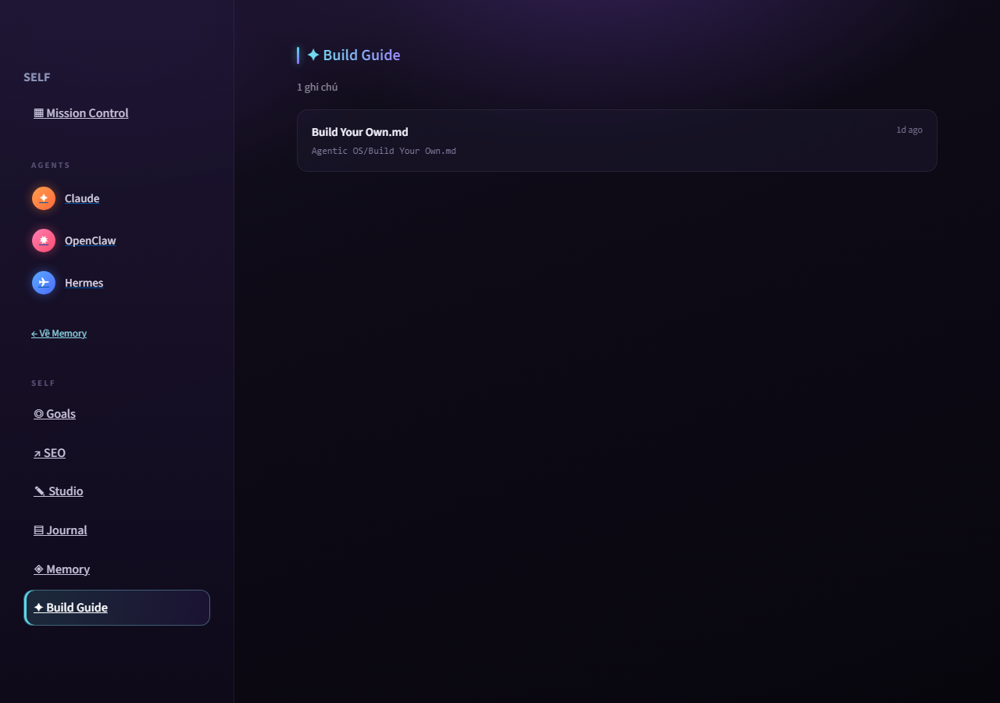
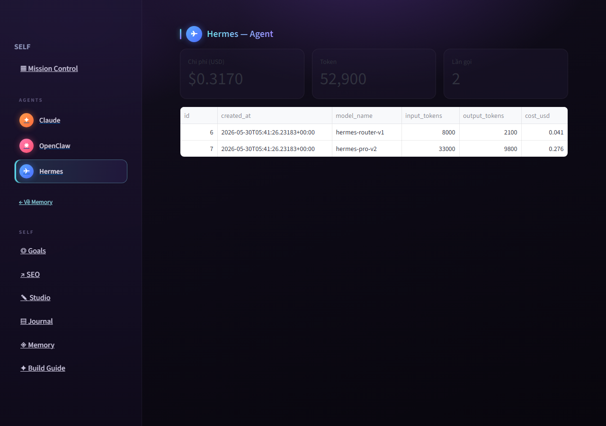
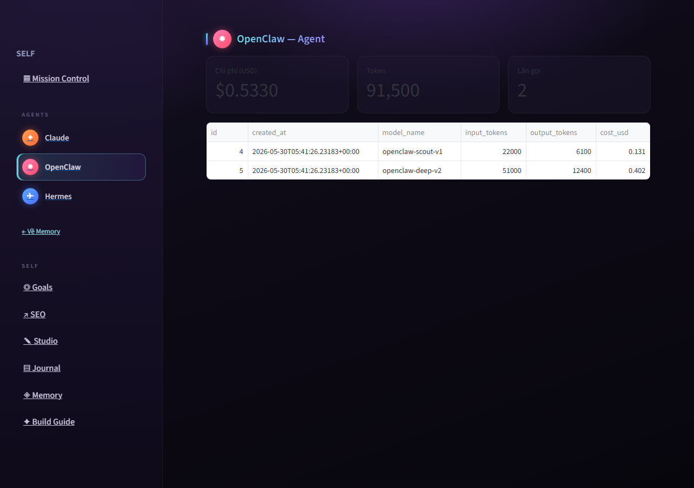

# Hermes OS Dashboard v2.0

[](https://agent-hermes-os.streamlit.app/)

🔗 **Live demo:** https://agent-hermes-os.streamlit.app/

Bảng điều khiển trực quan (Streamlit + Supabase) cho hệ điều hành cá nhân **Hermes OS — "Bác Sĩ Chính Mình"**. Chuyển mô hình vận hành từ dòng lệnh sang một buồng lái duy nhất: theo dõi chi phí AI, điều phối đội agent, và quản trị cơ sở tri thức Obsidian Vault.

## Ảnh chụp

| Memory — Obsidian Vault | Mission Control |
|---|---|
|  |  |

| Agent (Claude) | Self section (Build Guide) |
|---|---|
|  |  |

| Agent (Hermes) | Agent (OpenClaw) |
|---|---|
|  |  |

## Tính năng

- **Memory — Obsidian Vault**: liệt kê ghi chú `.md` từ Supabase dưới dạng thẻ kính (glassmorphism), lọc theo `Recent / Notes / Omi`, tìm kiếm theo tên.
- **Agents** (Claude / OpenClaw / Hermes): avatar gradient riêng, click để mở panel chi phí từng agent.
- **AI Spend**: tổng chi phí USD, token, số lần gọi, biểu đồ chi phí theo model — đọc bằng `service_role` (dữ liệu nhạy cảm, không lộ cho `anon`).
- **Giao diện tối tím-indigo** + accent cyan, đồng bộ nguyên mẫu thiết kế.

## Kiến trúc

| Thành phần | Vai trò |
|---|---|
| `app.py` | Ứng dụng Streamlit: UI, điều hướng qua query param (`?nav=...`), 2 client Supabase (anon đọc công khai / service_role đọc nhạy cảm). |
| `security/00_full_setup.sql` | Tạo bảng (`obsidian_vault`, `ai_spend`, `mission_control`) + seed + RLS. Chạy 1 lần. |
| `security/rls_policies.sql` | Chỉ phần RLS (nếu bảng đã tồn tại). |
| `security/SECURITY.md` | Ghi chú bảo mật & checklist. |
| `shoot.py` | Chụp ảnh verify giao diện bằng Playwright. |

## Bảo mật

- **Không hardcode key** — đọc qua `st.secrets`. File `.streamlit/secrets.toml` nằm trong `.gitignore`.
- **RLS bật** trên cả 3 bảng. `anon` chỉ đọc `obsidian_vault` + `mission_control`; **không** đọc/ghi `ai_spend`.
- **service_role** chỉ dùng server-side (Streamlit server, n8n). Không bao giờ nhúng vào client JS.
- Giá trị tệp được `html.escape()` trước khi render (chống XSS).

## Cài đặt & chạy

1. Cài đặt các thư viện phụ thuộc:
   ```bash
   pip install -r requirements.txt
   ```
2. Tạo cấu hình cục bộ từ tệp mẫu:
   ```bash
   cp .streamlit/secrets.toml.example .streamlit/secrets.toml
   ```
   *Lưu ý: Mở tệp `.streamlit/secrets.toml` và điều chỉnh đường dẫn thư mục Obsidian của bạn tại dòng `OBSIDIAN_VAULT_PATH`.*
3. Khởi chạy ứng dụng:
   ```bash
   streamlit run app.py
   ```
   *Cơ sở dữ liệu SQLite cục bộ `hermes_os.db` sẽ tự động được khởi tạo và khôi phục dữ liệu từ thư mục `backups/` trong lần đầu chạy.*

   Mặc định mở tại địa chỉ: http://localhost:8501

## Đồng bộ Obsidian Vault cục bộ

Để đồng bộ các ghi chú Obsidian mới nhất từ máy tính của bạn vào cơ sở dữ liệu cục bộ:
```bash
python scripts/run_sync.py
```

## Sao lưu cơ sở dữ liệu

Để xuất toàn bộ dữ liệu từ tệp cơ sở dữ liệu SQLite cục bộ ra các tệp JSON trong thư mục `backups/` trước khi commit & push lên Git:
```bash
python scripts/backup_sqlite.py
```


---

> ⚠️ Trước khi public repo hoặc chia sẻ: kiểm tra `secrets.toml` không bị commit (`git check-ignore .streamlit/secrets.toml`).

## License

[MIT](LICENSE) © 2026 Tuanphan1175
